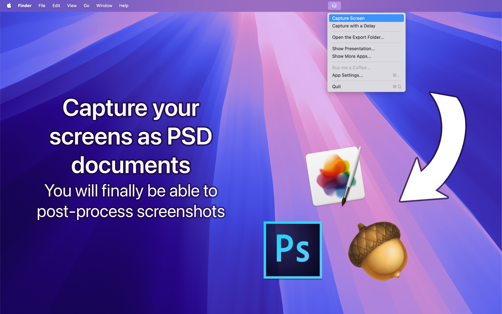

# ScreenToLayers for Mac

**ScreenToLayers** is a powerful, free, and open-source macOS application that captures detailed screenshots as Photoshop files, preserving every visual layer, including individual windows and interface elements. Inspired by the original **ScreenToLayer**, this reimplementation delivers an enhanced, modernized experience, overcoming numerous technical challenges.

## Why This Update?

The previous version of ScreenToLayers relied on outdated APIs. This reimplementation updates the project to meet the latest macOS security requirements, such as sandboxing, and overcomes the deprecation of some Carbon functions. We ask users not to upload copies to the App Store.

## Technical Challenges

ScreenToLayers is an intricate project that tackles many tricky processes, making it a valuable resource for developers. Here are some highlights:

- **Photoshop File Generation**: Converts screenshot layers into Photoshop (PSD) files, making each UI component accessible as an individual layer.
- **Mac Menu Bar App**: Runs exclusively in the menu bar for seamless access without cluttering the Dock.
- **Screenshots with ScreencaptureKit**: Leverages Apple's ScreencaptureKit, despite its developer-unfriendly quirks, to deliver high-quality screenshots.
- **Shortcuts with MASShortcut**: Enables custom shortcut configuration, integrated smoothly with SwiftUI.
- **In-App Purchases**: Includes an option to "Buy a Coffee," allowing users to support the project with a small donation.
- **Persistent URL Access**: Manages secure file and directory access across sessions, complying with macOS sandboxing requirements.
- **Unique Window Management in SwiftUI**: Ensures only one instance of key app windows, using a default value for efficient window management.
- **Automatic XCStrings Generation**: Streamlines localization by auto-generating string files.
- **Interoperability with Objective-C and Swift**: Demonstrates how to integrate Swift and Objective-C code, calling each language’s functions from the other.

## Troubleshooting

- **Rendering Differences with Carbon API**: Users familiar with the previous Carbon-based version of ScreenToLayers may notice some rendering differences. The old Carbon API was more consistent in reproducing visual fidelity. While ScreencaptureKit is the modern alternative, slight discrepancies in window appearance and layer details may occur.

## Important Notes

1. **Open Source and Free**: This project is fully open source, with an optional in-app purchase for those who’d like to support future development.
2. **Respect the Icon**: Please avoid reusing the app’s icon for other projects, as has unfortunately happened before.
3. **No Unauthorized App Store Uploads**: We kindly ask that you refrain from uploading copies of this project to the App Store.

## About NeededApps

ScreenToLayers is developed by **[NeededApps](https://neededapps.com)**, creators of other innovative tools for macOS. Our side project, **[AnotherTextApp](https://anothertextapp.com),** also provides various tools for researchers.

Thank you for choosing ScreenToLayers! We hope it enhances your workflow, and we welcome any feedback or contributions.
